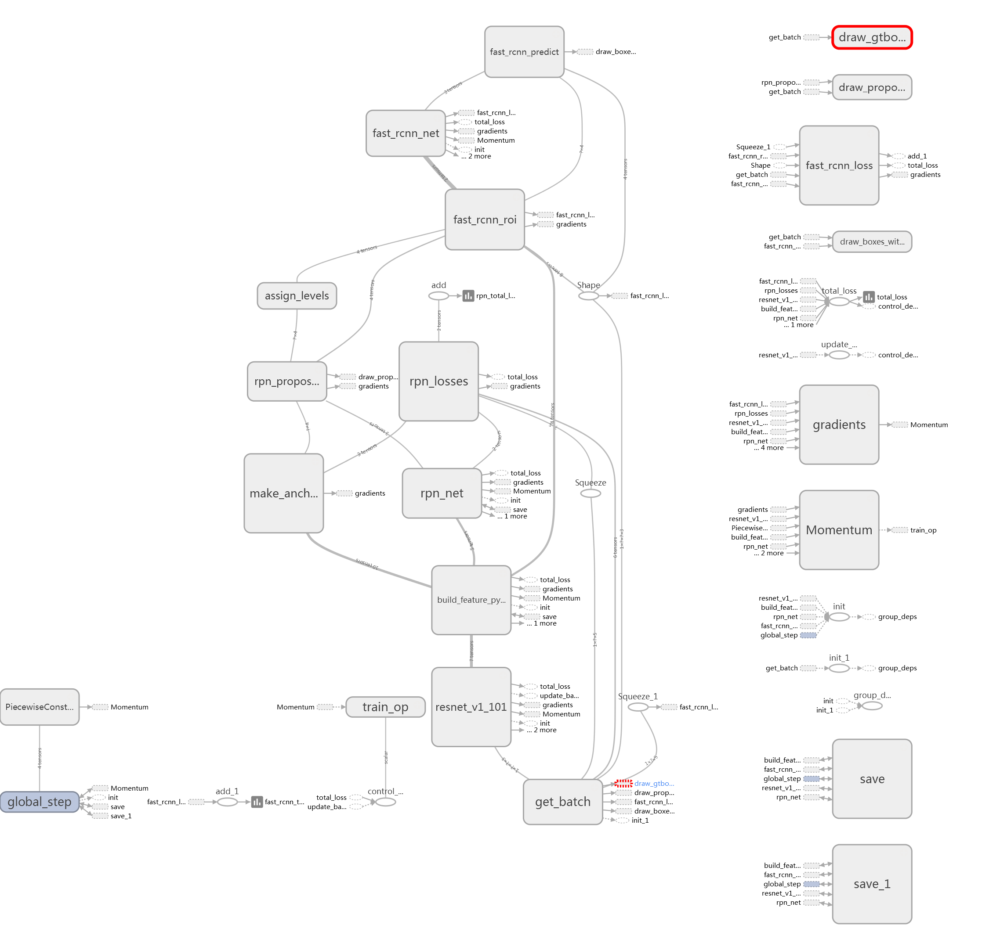

# Clone and modified from https://github.com/yangxue0827/FPN_Tensorflow
## Deleted some huge files from git source to keep it clean and easy to use.

# Train a model using your own custom dataset
## 1.Place your dataset files in `data/` folders, named `layer` for example
### 1.1 Place original images in `data/layer/JPEGImages` folder.
### 1.2 Place original annotations in `data/layer/annotations` folder.
### 1.3 Run `gen_classes.py` to generate classes file named `classes.txt` in `data/layer/` folder.
### 1.3 Run `convert_txt2xml.py` to convert txt annotations to xml ones from folder `data/layer/annotations` to folder `data/layer/Annotations`.
### 1.4 Run `data/io/convert_data_to_tfrecord.py` to convert images and annotations to tfrecords files which located in folder `data/tfrecords`.
* run `tools/test.py` to label ground truth annotations on images to check if the data are right.
## 2.Modify configures
### 2.1 Modify `libs/configs/cfgs.py` to coordinate your own dataset: layer.
* Parameters
```Shell
NET_NAME = 'resnet_v1_101'
DATASET_NAME = 'layer'
VERSION = 'v1_{}'.format(DATASET_NAME)
ANCHOR_SCALES = [0.5, 1., 2.]
ANCHOR_RATIOS = [0.1, 0.2, 0.3] # height to width
SCALE_FACTORS = [10., 5., 1., 0.5]
```
* Classes
```Shell
CLASS_NUM = 1 #Equal to really class number (except for background class)
```
### 2.2 Modify configure file in folder `configs` according to NET_NAME
* `configs/config_res101.py`
```Shell
pretrained_model_path # to use a pretrained model
batch_size
```
### 2.3 Add dataset name to `data/io/read_tfrecord.py`
* line 1 of function `next_batch`
```Shell
['nwpu', 'airplane', 'SSDD', 'ship', 'pascal', 'coco', 'icecream', 'layer']
```
### 2.4 Add your `NAME_LABEL_MAP` corresponding to your own dataset in `libs/label_name_dict/label_dict.py`
* Directly add them if the number of classes is not big
* Or add `NAME_LABEL_MAP` using generated `data/layer/classes.txt` file.
* Examples:
```Shell
elif cfgs.DATASET_NAME == 'icecream':
  NAME_LABEL_MAP = {}
  NAME_LABEL_MAP['back_ground'] = 0
  with open('classes.txt') as f:
    lines = [line.strip() for line in f.readlines()]
  for i, line in enumerate(lines, 1):
    NAME_LABEL_MAP[line] = i
elif cfgs.DATASET_NAME == 'layer':
  NAME_LABEL_MAP = {
      'back_ground': 0,
      "layer": 1
  }
```
## 3.Run `scripts/train.sh` to train the model and the `output` and `logs` will be saved in the root directory
```Shell
cd $ FPN_Tensorflow
# ./scripts/train.sh GPU DATASET
./scripts/train.sh 0 cooler
```
## 4.Run `scripts/[test.sh, eval.sh, demo.sh, inference.sh]` to test, evaluate the model or run a demo using the trained model
```Shell
cd $ FPN_Tensorflow
# ./scripts/test.sh GPU MODEL_PATH IMG_NUM
./scripts/test.sh 0 output/res101_trained_weights/v1_layer/layer_model.ckpt 20
# ./scripts/eval.sh GPU MODEL_PATH IMG_NUM
./scripts/eval.sh 0 output/res101_trained_weights/v1_layer/layer_model.ckpt 20
# ./scripts/demo.sh GPU MODEL_PATH
./scripts/demo.sh 0 output/res101_trained_weights/v1_layer/layer_model.ckpt
# ./scripts/inference.sh GPU MODEL_PATH
./scripts/inference.sh 0 output/res101_trained_weights/v1_layer/layer_model.ckpt
```

# Errors may encountered

## 1.InvalidArgumentError (see above for traceback): LossTensor is inf or nan : Tensor had NaN values
```Shell
InvalidArgumentError (see above for traceback): LossTensor is inf or nan : Tensor had NaN values
	 [[Node: train_op/CheckNumerics = CheckNumerics[T=DT_FLOAT, message="LossTensor is inf or nan", _device="/job:localhost/replica:0/task:0/device:GPU:0"](control_dependency)]]
	 [[Node: gradients/rpn_net/concat_grad/Squeeze_3/_1493 = _Recv[client_terminated=false, recv_device="/job:localhost/replica:0/task:0/device:CPU:0", send_device="/job:localhost/replica:0/task:0/device:GPU:0", send_device_incarnation=1, tensor_name="edge_8085_gradients/rpn_net/concat_grad/Squeeze_3", tensor_type=DT_INT64, _device="/job:localhost/replica:0/task:0/device:CPU:0"]()]]
```
* This was raised because the annotations were beyond the images, for example, xmax or ymax larger than width or height of image, or xmin or ymin less than 0.
* This error has been solved by adding these lines in `data/io/convert_data_to_tfrecord.py`:
```Shell
xmin = np.where(xmin < 0, 0, xmin)
ymin = np.where(ymin < 0, 0, ymin)
xmax = np.where(xmax > img_width, img_width, xmax)
ymax = np.where(ymax > img_height, img_height, ymax)
```

## 2.tensorflow.python.framework.errors_impl.UnknownError: exceptions.OverflowError: signed integer is less than minimum
```Shell
UnknownError (see above for traceback): exceptions.OverflowError: signed integer is less than minimum
	 [[Node: fast_rcnn_loss/PyFunc_1 = PyFunc[Tin=[DT_FLOAT, DT_FLOAT, DT_INT32], Tout=[DT_UINT8], token="pyfunc_7", _device="/job:localhost/replica:0/task:0/device:CPU:0"](rpn_losses/Squeeze/_1579, fast_rcnn_loss/mul_1/_1759, fast_rcnn_loss/strided_slice_1/_1761)]]
	 [[Node: draw_proposals/Reshape_2/tensor/_1825 = _Recv[client_terminated=false, recv_device="/job:localhost/replica:0/task:0/device:GPU:0", send_device="/job:localhost/replica:0/task:0/device:CPU:0", send_device_incarnation=1, tensor_name="edge_3802_draw_proposals/Reshape_2/tensor", tensor_type=DT_UINT8, _device="/job:localhost/replica:0/task:0/device:GPU:0"]()]]
```
* The reason of this error is the same as `1.InvalidArgumentError`.

# Feature Pyramid Networks for Object Detection
A Tensorflow implementation of FPN detection framework.
You can refer to the paper [Feature Pyramid Networks for Object Detection](https://arxiv.org/abs/1612.03144)
Rotation detection method baesd on FPN reference [R2CNN](https://github.com/yangxue0827/R2CNN_FPN_Tensorflow) and [R2CNN_HEAD](https://github.com/yangxue0827/R2CNN_HEAD_FPN_Tensorflow) and [R-DFPN](https://github.com/yangxue0827/R-DFPN_FPN_Tensorflow)
If useful to you, please star to support my work. Thanks.

# Configuration Environment
ubuntu(Encoding problems may occur on windows) + python2 + tensorflow1.2 + cv2 + cuda8.0 + GeForce GTX 1080
You can also use docker environment, command: docker push yangxue2docker/tensorflow3_gpu_cv2_sshd:v1.0

# Installation
  Clone the repository
  ```Shell
  git clone https://github.com/yangxue0827/FPN_Tensorflow.git
  ```

# Make tfrecord
The image name is best in English.
The data is VOC format, reference [here](sample.xml)
data path format  ($FPN_ROOT/data/io/divide_data.py)
VOCdevkit
>VOCdevkit_train
>>Annotation
>>JPEGImages

>VOCdevkit_test
>>Annotation
>>JPEGImages

  ```Shell
  cd $FPN_ROOT/data/io/
  python convert_data_to_tfrecord.py --VOC_dir='***/VOCdevkit/VOCdevkit_train/' --save_name='train' --img_format='.jpg' --dataset='ship'
  ```

# Demo
1、Unzip the weight $FPN_ROOT/output/res101_trained_weights/*.rar
2、put images in $FPN_ROOT/tools/inference_image
3、Configure parameters in $FPN_ROOT/libs/configs/cfgs.py and modify the project's root directory
4、image slice
  ```Shell
  cd $FPN_ROOT/tools
  python inference.py
  ```
5、big image
  ```Shell
  cd $FPN_ROOT/tools
  python demo.py --src_folder=.\demo_src --des_folder=.\demo_des
  ```


# Train
1、Modify $FPN_ROOT/libs/lable_name_dict/***_dict.py, corresponding to the number of categories in the configuration file
2、download pretrain weight([resnet_v1_101_2016_08_28.tar.gz](http://download.tensorflow.org/models/resnet_v1_101_2016_08_28.tar.gz) or [resnet_v1_50_2016_08_28.tar.gz](http://download.tensorflow.org/models/resnet_v1_50_2016_08_28.tar.gz)) from [here](https://github.com/yangxue0827/models/tree/master/slim), then extract to folder $FPN_ROOT/data/pretrained_weights
3、
  ```Shell
  cd $FPN_ROOT/tools
  python train.py
  ```

# Test tfrecord
  ```Shell
  cd $FPN_ROOT/tools
  python $FPN_ROOT/tools/test.py
  ```

# eval
  ```Shell
  cd $FPN_ROOT/tools
  python ship_eval.py
  ```

# Summary
  ```Shell
  tensorboard --logdir=$FPN_ROOT/output/res101_summary/
  ```


# Graph


# Test results
## airplane


## sar_ship


## ship


# Note
This code works better when detecting single targets, but not suitable for multi-target detection tasks. Hope you can help find bugs, thank you very much.
